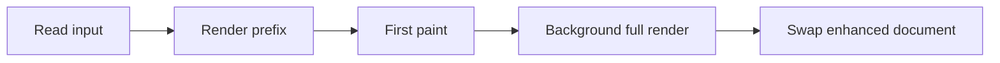
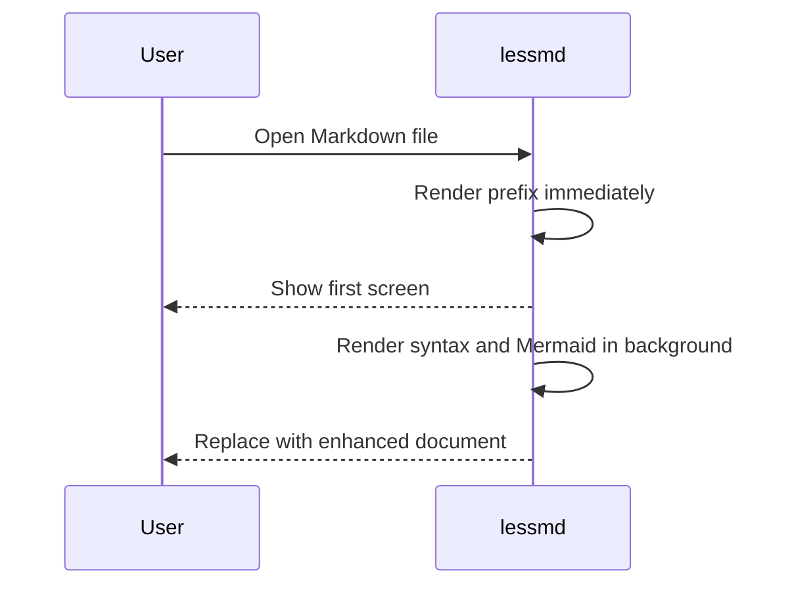

# lessmd

`lessmd` is a terminal pager for reading plain text and Markdown. It keeps the
core feel of `less`, but renders Markdown structure, tables, code blocks,
syntax highlighting, and Mermaid diagrams directly in the terminal.

This file is both documentation and a manual rendering fixture. Open it with:

```sh
lessmd docs/lessmd.md
```

Or, if you added the short alias:

```sh
lmd docs/lessmd.md
```

---

## Goals

- Open large files quickly with an instant first paint.
- Render Markdown readably without leaving the terminal.
- Keep pager behavior familiar for users of `less`.
- Support syntax-highlighted code and Mermaid diagrams by default.
- Keep the core pager logic pure and testable.

## Non-goals

- Replacing a full browser-based Markdown preview.
- Fetching remote images or rendering HTML as a browser would.
- Supporting every Markdown extension at the cost of startup time.
- Requiring scripting runtimes or system services.

## Basic Usage

Run `lessmd` with a file path:

```sh
lessmd README.md
lessmd docs/lessmd.md
lessmd --plain logs.txt
lessmd --markdown notes.txt
```

Read from standard input:

```sh
cat docs/lessmd.md | lessmd -
```

Disable enhancements at runtime:

```sh
lessmd --no-syntax --no-mermaid docs/lessmd.md
```

Show line numbers:

```sh
lessmd --line-numbers docs/lessmd.md
lessmd -N docs/lessmd.md
```

## Keybindings

| Action | Keys |
| --- | --- |
| Scroll down | `j`, `e`, Down |
| Scroll up | `k`, `y`, Up |
| Page down | Space, `f`, PageDown |
| Page up | `b`, PageUp |
| Half page down | `Ctrl-D` |
| Half page up | `Ctrl-U` |
| Top | `g g` |
| Bottom | `G` |
| Search | `/`, then Enter |
| Next match | `n` |
| Previous match | `N` |
| Outline | `o` |
| Next heading | `t` |
| Previous heading | `T` |
| Fold section | Tab |
| Pan left/right | Left/Right, `h`/`l` |
| Help | `?` |
| Quit | `q`, `Q` |

## Markdown Showcase

This section intentionally uses many Markdown elements so you can verify the
renderer in one place.

### Headings

# H1 Heading

## H2 Heading

### H3 Heading

#### H4 Heading

##### H5 Heading

###### H6 Heading

### Inline Formatting

Markdown supports **bold text**, *italic text*, ***bold italic text***,
~~strikethrough text~~, and `inline code`.

Links are shown with their target visible: [lessmd repository](https://github.com/kerloom/lessmd).

Images are shown as alt text plus the URL: 

Raw HTML is displayed as literal text rather than interpreted by a browser:

<strong>This is raw HTML, not rendered HTML.</strong>

### Paragraphs And Line Breaks

This is a normal paragraph. It wraps according to the terminal width and should
remain readable on both narrow and wide terminals. The renderer operates on
terminal cells, so wide Unicode characters should not corrupt wrapping.

This line ends with a hard break.  
This line should start on the next rendered line.

### Blockquotes

> A terminal reader should make structure visible without making the document
> noisy. Blockquotes use a left bar and dim styling so quoted material remains
> easy to distinguish from the main text.

Nested blockquotes:

> First level quote.
>
> > Second level quote.

### Lists

Unordered list:

- Fast startup
- Markdown rendering
- Syntax highlighting
- Mermaid diagrams
- Familiar navigation

Nested unordered list:

- Rendering
  - Plain text
  - Markdown
  - Syntax-highlighted code
  - Mermaid diagrams
- Pager behavior
  - Vertical scrolling
  - Horizontal panning
  - Search
  - Folding

Ordered list:

1. Read the source file or standard input.
2. Render a small prefix immediately for first paint.
3. Render enhanced content in the background.
4. Swap in the full rendered document when ready.

Task list:

- [x] Plain-text pager
- [x] Markdown renderer
- [x] Mermaid diagrams
- [x] Syntax highlighting
- [x] Instant first paint
- [ ] True on-demand virtualized renderer

### Horizontal Rule

The line below is a horizontal rule.

---

### Tables

| Feature | Default | Runtime flag | Notes |
| --- | --- | --- | --- |
| Markdown rendering | On | `--plain` disables auto Markdown mode | Extension-based detection for `.md` and `.markdown`. |
| Syntax highlighting | On | `--no-syntax` | Uses `syntect` when the feature is compiled in. |
| Mermaid rendering | On | `--no-mermaid` | Uses a pure-Rust renderer with graceful fallback. |
| Line numbers | Off | `-N`, `--line-numbers` | Narrows wrap width to preserve the gutter. |
| ANSI passthrough | On for plain text | `--plain` strips ANSI | Similar to `less -R` behavior by default. |

Wide table cells should truncate rather than overflow the viewport:

| Column | Very long value |
| --- | --- |
| Path | `/this/is/a/very/long/path/that/should/be/truncated/when/the/terminal/is/narrow/enough/to/need/it.md` |
| Endpoint | `POST /api/disbursement/{batchId}/initiate-international-payment-for-each-employee` |

### Code Blocks

Rust example:

```rust
use std::path::PathBuf;

#[derive(Debug)]
struct Config {
    line_numbers: bool,
    input: PathBuf,
}

fn main() {
    let config = Config {
        line_numbers: true,
        input: PathBuf::from("docs/lessmd.md"),
    };
    println!("opening {:?}", config.input);
}
```

TypeScript example:

```typescript
type RenderOptions = {
  syntax: boolean;
  mermaid: boolean;
};

function describeOptions(options: RenderOptions): string {
  const enabled = Object.entries(options)
    .filter(([, value]) => value)
    .map(([key]) => key);

  return `enabled: ${enabled.join(", ")}`;
}

console.log(describeOptions({ syntax: true, mermaid: true }));
```

Shell example:

```sh
cargo fmt --check
cargo clippy --all-targets -- -D warnings
cargo test
```

Unknown-language fallback:

```unknown-language
this block should still render as plain code
even though no syntax grammar exists for it
```

Indented code block:

    This is an indented code block.
    It should render as code even without a language label.

### Mermaid Diagrams

Flowchart:



Sequence diagram:



### Escaping And Punctuation

Smart punctuation should remain readable: "quotes", 'apostrophes', and dashes --
including longer prose with punctuation -- should not break wrapping.

Backslash escapes should display literal Markdown markers: \*not italic\*,
\`not code\`, and \[not a link\](https://example.com).

### Unicode

Unicode text should render without corrupting table or line widths:

- Check mark: ✅
- Warning: ⚠️
- Box drawing: ┌─┬─┐
- Greek: α β γ
- Emoji text: terminal rendering is useful 🚀

## Implementation Notes

`lessmd` keeps terminal I/O in `main.rs`. The pager state and rendering logic stay
in library modules so scrolling, search, folding, wrapping, and render behavior can
be tested without a terminal.

The current implementation pre-renders documents into terminal lines. For large
inputs, it renders a source prefix first, then swaps in the full render from a
background worker. Background messages are generation-checked so stale renders from
an earlier terminal size are ignored.

## Build And Verify

Use the standard project verification commands:

```sh
cargo fmt --check
cargo clippy --all-targets -- -D warnings
cargo clippy --all-targets --no-default-features -- -D warnings
cargo test
cargo test --no-default-features
```

Build a release binary:

```sh
cargo build --release
```

Install locally:

```sh
mkdir -p "$HOME/.local/bin"
cp target/release/lessmd "$HOME/.local/bin/lessmd"
```

## Manual Test Checklist

- [ ] Open this file with `lessmd docs/lessmd.md`.
- [ ] Confirm headings use distinct styles.
- [ ] Confirm bullet text after headings is not colored like the heading.
- [ ] Confirm tables fit inside the viewport.
- [ ] Confirm code blocks are highlighted.
- [ ] Confirm Mermaid diagrams render or fall back gracefully.
- [ ] Confirm `/render` search highlights matches.
- [ ] Confirm `o` opens the outline.
- [ ] Confirm Tab folds and unfolds sections.
- [ ] Confirm Left/Right or `h`/`l` pan wide content.
