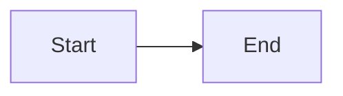
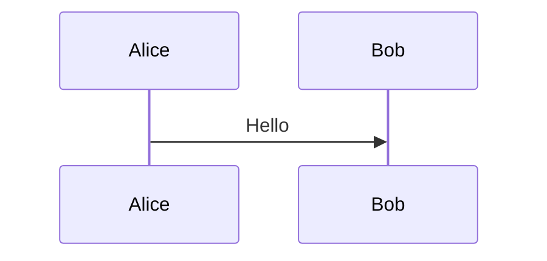

# Mermaid Fixture

Before the diagrams.

```mermaid
graph LR
    A[Start] --> B[End]
```

Between diagrams.

```mermaid
sequenceDiagram
    Alice->>Bob: Hello
```

Invalid diagram should fall back.

```mermaid
this is invalid mermaid
```

After the diagrams.
