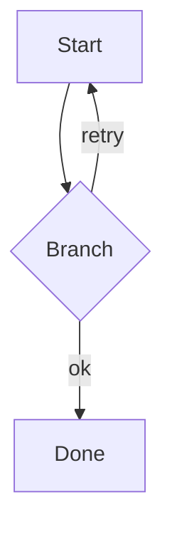
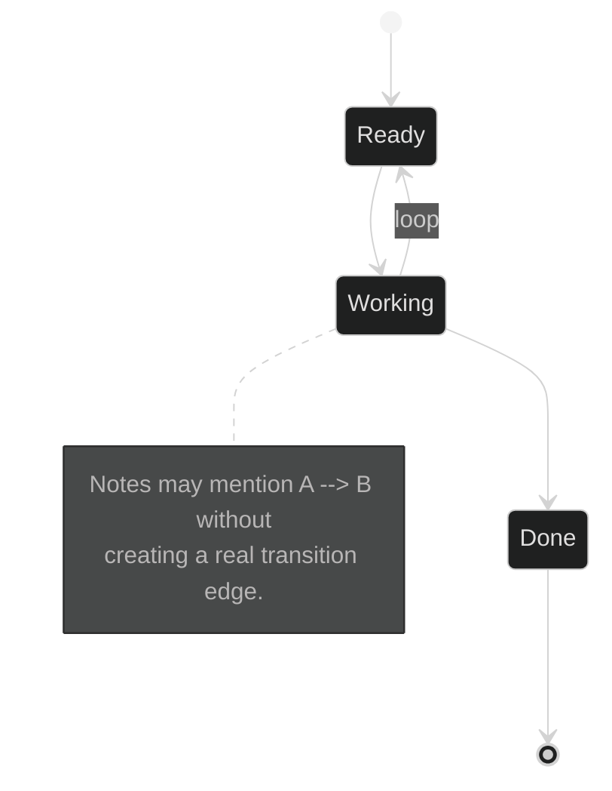
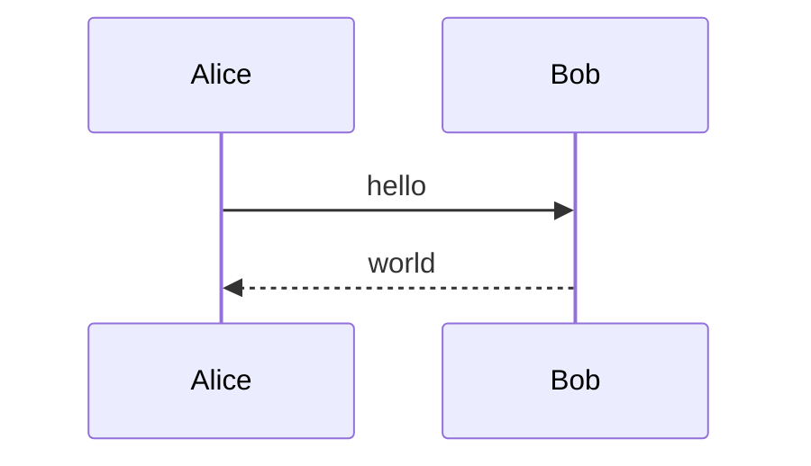

# Mermaid cycle fixture

Synthetic diagrams that exercise cyclic rendering without hanging the pager.
All three diagrams should render.

```mermaid
flowchart TD
    A[Start] --> B{Branch}
    B -->|ok| C[Done]
    B -->|retry| A
```

```mermaid
%% leading Mermaid comments are accepted before the state header
%%{init: {'theme': 'dark'}}%%
stateDiagram-v2
    [*] --> Ready
    Ready --> Working
    Working --> Ready: loop
    Working --> Done
    Done --> [*]
    note right of Working
        Notes may mention A --> B without
        creating a real transition edge.
    end note
```

```mermaid
sequenceDiagram
    participant A as Alice
    participant B as Bob
    A->>B: hello
    B-->>A: world
```
