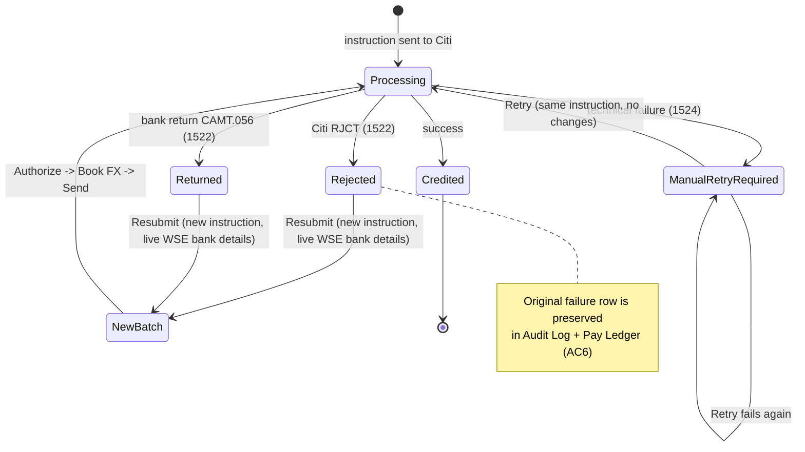
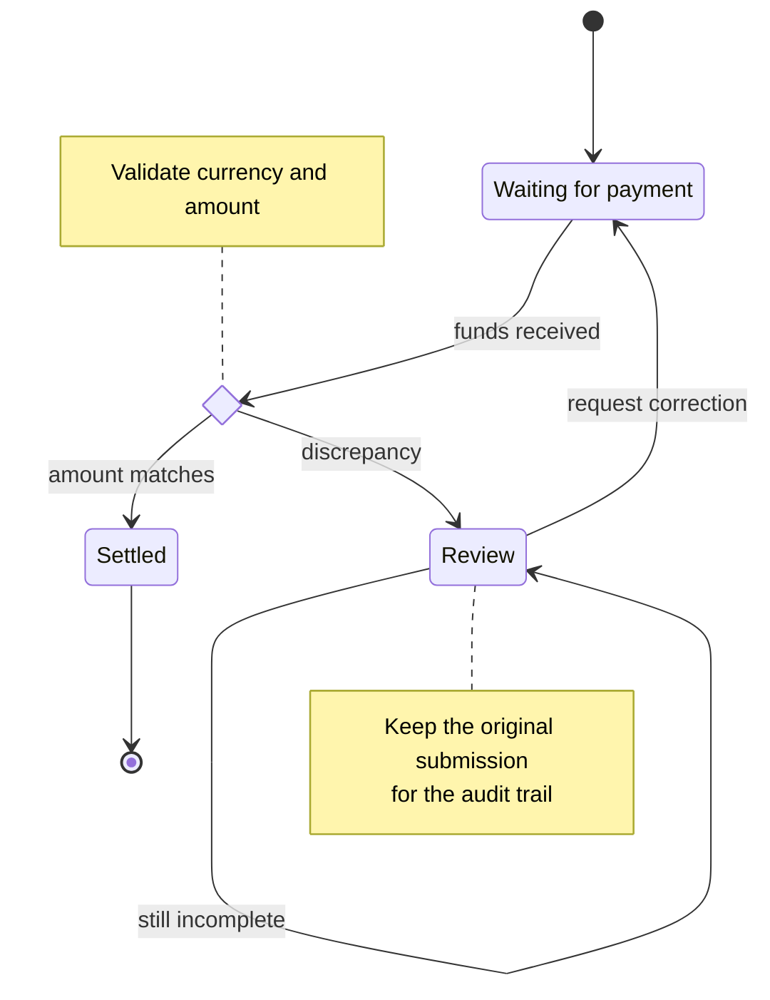

# State Diagrams

## Payment recovery

```mermaid
stateDiagram-v2
    [*] --> Processing: instruction sent to Citi
    Processing --> Credited: success
    Processing --> ManualRetryRequired: technical failure (1524)
    Processing --> Returned: bank return CAMT.056 (1522)
    Processing --> Rejected: Citi RJCT (1522)

    ManualRetryRequired --> Processing: Retry (same instruction, no changes)
    ManualRetryRequired --> ManualRetryRequired: Retry fails again

    Rejected --> NewBatch: Resubmit (new instruction, live WSE bank details)
    Returned --> NewBatch: Resubmit (new instruction, live WSE bank details)
    NewBatch --> Processing: Authorize -> Book FX -> Send

    Credited --> [*]
    note right of Rejected
        Original failure row is preserved
        in Audit Log + Pay Ledger (AC6)
    end note
```

## Settlement review

```mermaid
stateDiagram-v2
    state "Waiting for payment" as Waiting
    state Decision <<choice>>
    [*] --> Waiting
    Waiting --> Decision: funds received
    Decision --> Settled: amount matches
    Decision --> Review: discrepancy
    Review --> Waiting: request correction
    Review --> Review: still incomplete
    Settled --> [*]
    note left of Decision: Validate currency and amount
    note right of Review
        Keep the original submission
        for the audit trail
    end note
```
