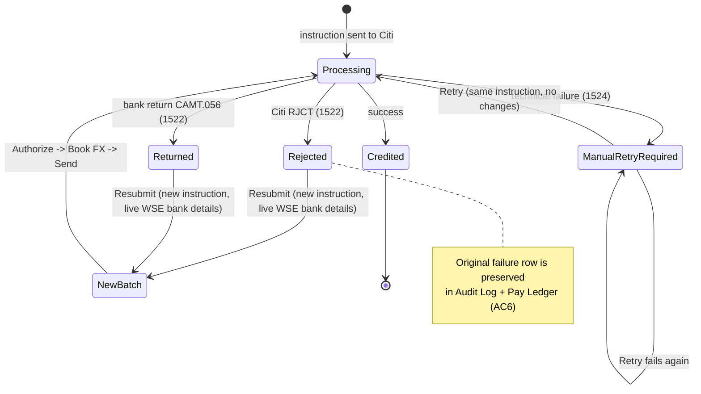

# Payment Recovery

```mermaid
stateDiagram-v2
    [*] --> Processing: instruction sent to Citi
    Processing --> Credited: success
    Processing --> ManualRetryRequired: technical failure (1524)
    Processing --> Returned: bank return CAMT.056 (1522)
    Processing --> Rejected: Citi RJCT (1522)

    ManualRetryRequired --> Processing: Retry (same instruction, no changes)
    ManualRetryRequired --> ManualRetryRequired: Retry fails again

    Rejected --> NewBatch: Resubmit (new instruction, live WSE bank details)
    Returned --> NewBatch: Resubmit (new instruction, live WSE bank details)
    NewBatch --> Processing: Authorize -> Book FX -> Send

    Credited --> [*]
    note right of Rejected
        Original failure row is preserved
        in Audit Log + Pay Ledger (AC6)
    end note
```
