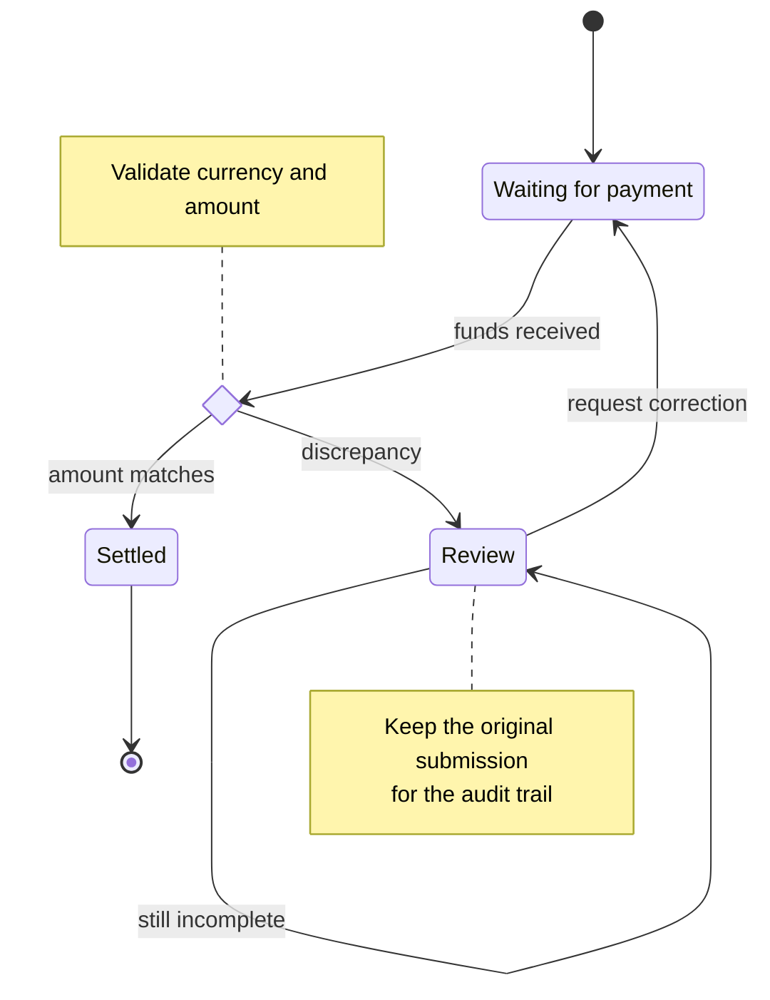

# Settlement Review

```mermaid
stateDiagram-v2
    state "Waiting for payment" as Waiting
    state Decision <<choice>>
    [*] --> Waiting
    Waiting --> Decision: funds received
    Decision --> Settled: amount matches
    Decision --> Review: discrepancy
    Review --> Waiting: request correction
    Review --> Review: still incomplete
    Settled --> [*]
    note left of Decision: Validate currency and amount
    note right of Review
        Keep the original submission
        for the audit trail
    end note
```
