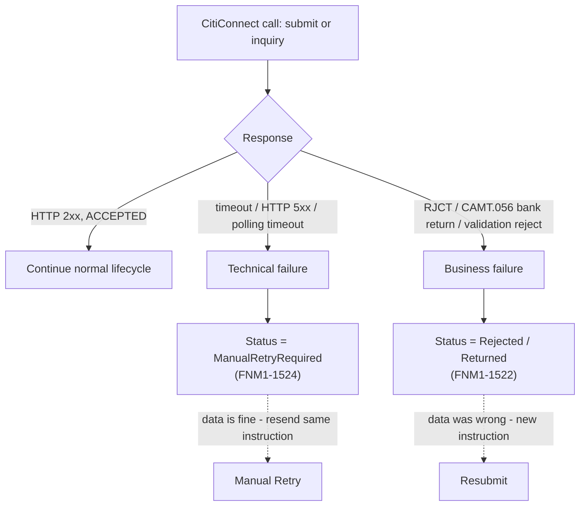
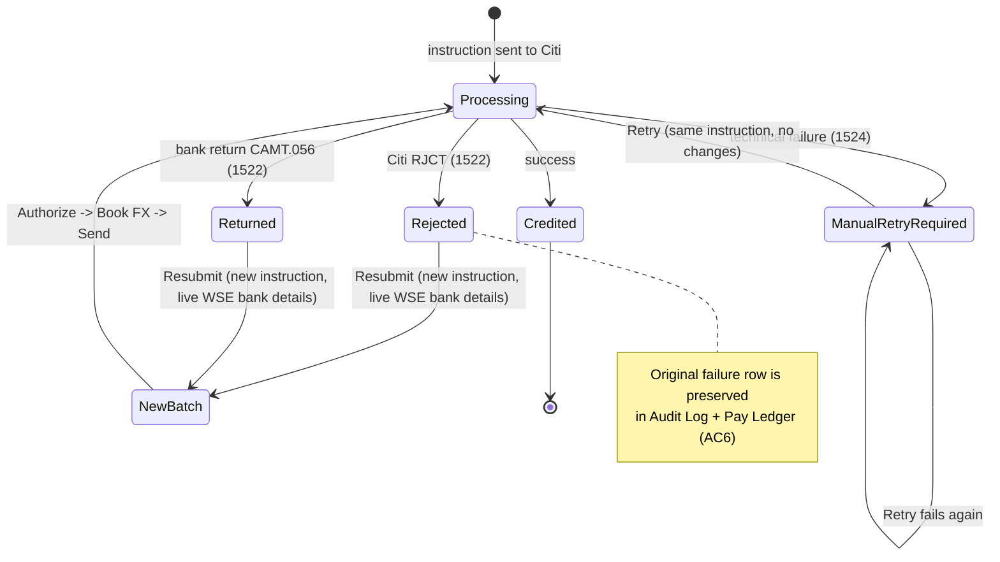
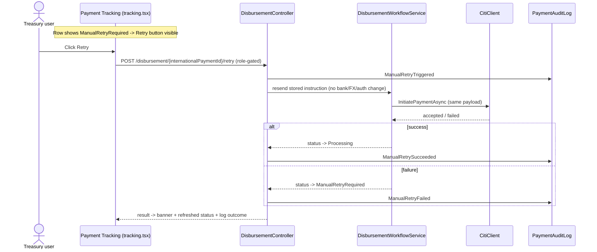

# WorldLink failure-handling diagrams (fixture)

Minimal extract used to regression-test that pathological Mermaid in this
document cannot hang or crash the pager. Full plan lives outside this repo.







```mermaid
sequenceDiagram
    actor U as Payroll user
    participant FE as Review Payments (review.tsx)
    participant API as DisbursementController
    participant WF as DisbursementWorkflowService
    participant WSE as WSE Profile
    participant Audit as PaymentAuditLog

    Note over FE: Row shows Rejected/Returned -> Resubmit button visible
    U->>FE: Click Resubmit
    FE->>API: POST /disbursement/{takeHomePayId}/resubmit (role-gated)
    API->>WSE: fetch LIVE bank account / SWIFT
    Note over API,WF: keep net / ccy / purpose / employeeId LOCKED
    API->>WF: new Payment Instruction ID + new standalone batch
    API->>Audit: Resubmitted (original Rejected/Returned event preserved)
    WF-->>API: new batch created (Awaiting Approval)
    API-->>FE: banner; new batch appears in Disburse Pay -> Authorize -> Book FX -> Send
```
